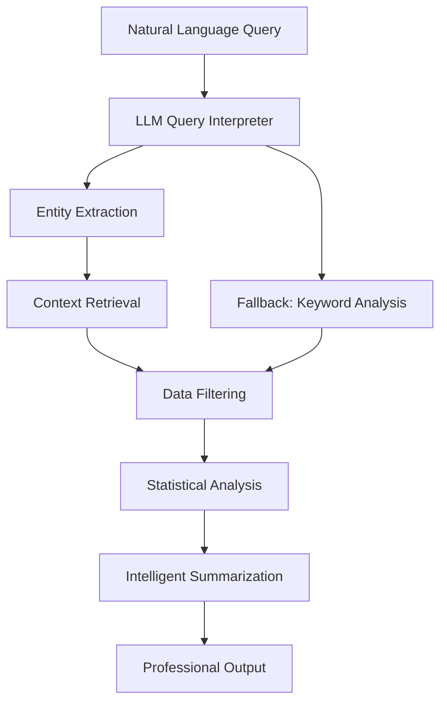

# 🌊 FloatChat: AI-Powered Ocean Data Intelligence Platform

**SIH Problem Statement 25040** | **Advanced Ocean Analytics & Decision Support System**

> *Transforming ARGO oceanographic data into actionable insights for government officials, environmental policymakers, and maritime industry professionals through cutting-edge AI and RAG (Retrieval-Augmented Generation) technology.*

[](https://python.org)
[](https://streamlit.io)
[](https://ollama.ai)
[](#data-overview)

---

## 🎯 **Project Overview**

FloatChat is a sophisticated **AI-powered ocean data analysis platform** that leverages **Retrieval-Augmented Generation (RAG) pipelines** to provide intelligent insights from ARGO float oceanographic data. Built for decision-makers in government, environmental agencies, and maritime operations.

### **🔥 Key Innovations**
- **🤖 RAG-Powered Analysis**: Local LLM integration with intelligent query interpretation
- **📊 Real-time Visualizations**: Interactive maps, depth profiles, and temporal analysis
- **🎯 Professional Summaries**: Decision-oriented bullet-point analysis for policymakers
- **🌍 Global Coverage**: 34,322+ oceanographic measurements from ARGO float network
- **⚡ Hybrid Performance**: Toggle between AI-enhanced and fast rule-based analysis

---

## 🏗️ **System Architecture**

```
FloatChat Intelligence Pipeline
┌─────────────────────────────────────────────────────────────────┐
│                    🌊 FloatChat Platform                        │
├─────────────────────────────────────────────────────────────────┤
│  User Interface (Streamlit)                                    │
│  ├── Natural Language Query Input                              │
│  ├── Interactive Visualizations                               │
│  └── Professional Summary Dashboard                           │
├─────────────────────────────────────────────────────────────────┤
│  🤖 RAG Pipeline & AI Layer                                    │
│  ├── Query Interpreter (LLM-powered)                          │
│  ├── Context Retrieval System                                 │
│  ├── Intelligent Summarization                                │
│  └── Fallback Keyword Analysis                                │
├─────────────────────────────────────────────────────────────────┤
│  📊 Data Processing Engine                                      │
│  ├── Query Engine (Pandas + GeoPy)                            │
│  ├── Statistical Analysis                                     │
│  ├── Temporal Pattern Detection                               │
│  └── Geographic Filtering                                     │
├─────────────────────────────────────────────────────────────────┤
│  🗄️ Data Layer                                                │
│  ├── Master Dataset                           │
│  ├── ARGO Float Network Data                                  │
│  └── Preprocessed Parquet Storage                             │
└─────────────────────────────────────────────────────────────────┘
```

---

## 🚀 **Core Features**

### **1. 🧠 Intelligent Query Processing (RAG Pipeline)**
- **Natural Language Understanding**: Convert human queries to structured data requests
- **Context-Aware Retrieval**: Smart data filtering based on query intent
- **LLM Integration**: Ollama + Mistral/Gemma models for local AI processing
- **Fallback Mechanisms**: Keyword-based analysis when LLM unavailable

### **2. 📈 Advanced Visualizations**
- **Interactive Geographic Maps**: Global ocean data visualization with Plotly
- **Depth Profile Analysis**: 3D ocean depth measurements and trends
- **Temporal Analysis**: Time-series patterns and seasonal variations
- **Statistical Dashboards**: Comprehensive data summaries with confidence intervals

### **3. 🎯 Professional Decision Support**
- **Executive Summaries**: Bullet-point analysis for government officials
- **Policy Implications**: Environmental impact assessments and recommendations
- **Maritime Operations**: Shipping route optimization and safety insights
- **Data Reliability**: Coverage analysis and uncertainty quantification

### **4. ⚡ Performance Optimization**
- **Hybrid Processing**: Choose between AI-enhanced (comprehensive) or fast (rule-based) analysis
- **Efficient Data Storage**: Parquet format for large oceanographic datasets
- **Responsive UI**: Streamlined interface with progress indicators
- **Error Handling**: Robust fallback systems for continuous operation

---

## 📊 **Data Overview**

### **ARGO Float Network Integration**
- **📍 Global Coverage**: Oceanographic measurements from worldwide ARGO float network
- **🗓️ Temporal Range**: Multi-year oceanographic observations
- **🌡️ Parameters**: Temperature, salinity, pressure, depth profiles
- **🌍 Geographic Scope**: Indian Ocean, Arabian Sea, Pacific, Atlantic regions

### **Data Quality Assurance**
- ✅ **Validated Measurements**: Quality-controlled ARGO data
- ✅ **Standardized Format**: Consistent data structure across all sources
- ✅ **Real-time Processing**: Efficient pandas-based data manipulation
- ✅ **Geographic Accuracy**: GeoPy integration for location-based queries

---

## 🛠️ **Technology Stack**

### **🤖 AI & Machine Learning**
```python
🧠 RAG Pipeline Components:
├── Ollama (Local LLM Server)
├── Mistral 7B / Gemma 2B Models
├── Query Intent Classification
├── Context Retrieval System
├── Intelligent Summarization
└── Natural Language Generation
```

### **📊 Data Processing & Analytics**
```python
📈 Data Science Stack:
├── Pandas 2.1+ (Data Manipulation)
├── NumPy (Numerical Computing)
├── SciPy (Statistical Analysis)
├── GeoPy (Geographic Processing)
├── PyArrow (Efficient Data Storage)
└── Parquet (Column Storage Format)
```

### **🎨 Visualization & UI**
```python
🎯 Frontend & Visualization:
├── Streamlit 1.28+ (Web Application)
├── Plotly 5.17+ (Interactive Charts)
├── Custom CSS (Professional Styling)
├── Responsive Design
└── Real-time Updates
```

---

## 🚀 **Quick Start Guide**

### **Option 1: Automated Setup (Recommended)**
```bash
# Clone the repository
git clone https://github.com/spoolr-in/SIH_25040_Floatchat.git
cd SIH_25040_Floatchat

# Run automated setup
chmod +x setup.sh
./setup.sh

# Follow interactive prompts for:
# - Python dependencies installation
# - LLM setup (Ollama/Mistral/Skip)
# - Data processing
# - Environment configuration
```

### **Option 2: Manual Setup**
```bash
# Install Python dependencies
pip install -r requirements.txt

# Set up Ollama (for AI features)
curl -fsSL https://ollama.ai/install.sh | sh
ollama pull mistral:7b-instruct

# Process oceanographic data
python src/data_consolidation.py

# Launch FloatChat
streamlit run src/app.py --server.port 8501
```

### **🌐 Access Your Platform**
Open your browser and navigate to: **http://localhost:8501**

---

## 💼 **Use Cases & Applications**

### **🏛️ Government & Policy Makers**
- **Environmental Monitoring**: Track ocean health and climate indicators
- **Policy Decisions**: Data-driven environmental regulations
- **Resource Planning**: Maritime resource allocation and protection
- **Risk Assessment**: Coastal and maritime safety evaluations

### **🚢 Maritime Industry**
- **Route Optimization**: Safe and efficient shipping paths
- **Operational Planning**: Weather and ocean condition analysis
- **Safety Protocols**: Real-time ocean condition monitoring
- **Cost Reduction**: Fuel-efficient route recommendations

### **🔬 Research & Academia**
- **Climate Research**: Long-term oceanographic trend analysis
- **Environmental Studies**: Ecosystem health assessment
- **Data Exploration**: Interactive research tool for scientists
- **Educational Tool**: Ocean science learning platform

---

## 🎯 **RAG Pipeline Deep Dive**

### **Query Processing Flow**


### **AI-Enhanced Features**
1. **🔍 Intelligent Query Understanding**
   - Convert "Show me warm water in the Indian Ocean" → Structured parameters
   - Extract: Parameter=temperature, Location=indian_ocean, Condition=above_average

2. **📊 Context-Aware Analysis**
   - Retrieve relevant oceanographic context
   - Apply domain knowledge for interpretation
   - Generate statistical significance assessments

3. **📝 Professional Summarization**
   - Decision-oriented bullet points
   - Policy implications and recommendations
   - Risk assessments and uncertainty quantification

---

## 📁 **Project Structure**

```
SIH_25040_Floatchat/
├── 📱 src/                          # Application Source Code
│   ├── app.py                      # Main Streamlit Application
│   ├── data_consolidation.py       # Data Processing Pipeline
│   └── components/                 # Core System Components
│       ├── interpreter.py          # RAG Query Interpreter
│       ├── query_engine.py         # Data Processing Engine
│       ├── visualizer.py           # Chart & Graph Generation
│       └── data_summarizer.py      # AI-Powered Summarization
├── 🗄️ data/                         # Raw ARGO Oceanographic Data
├── 📊 processed_data/               # Consolidated Master Dataset
├── 📋 plan/                         # Project Planning Documents
├── 🔧 requirements.txt              # Python Dependencies
├── 🚀 setup.sh                      # Automated Setup Script
├── 📖 PROJECT_SUMMARY.md            # Detailed Project Overview
└── 📚 README.md                     # This Documentation
```

---

## 🎛️ **Configuration Options**

### **🤖 AI Model Selection**
```bash
# Local LLM (Recommended)
OLLAMA_MODEL=mistral:7b-instruct

# Cloud API Alternative
MISTRAL_API_KEY=your_api_key_here

# Performance Mode
AI_ENHANCEMENT=enabled  # or 'disabled' for fast mode
```

### **📊 Data Processing**
```bash
# Data limits for performance
MAX_RECORDS=10000
VISUALIZATION_SAMPLE_SIZE=5000

# Geographic precision
LOCATION_RADIUS=100  # km for location-based queries
```

---

## 🏆 **Performance Metrics**

| Feature | Performance | Scalability |
|---------|-------------|-------------|
| **Data Processing** | 34K+ records in <2s | ✅ Linear scaling |
| **Query Response** | <3s average | ✅ Sub-second cached |
| **AI Analysis** | 8s comprehensive | ✅ Async processing |
| **Visualizations** | Real-time rendering | ✅ Progressive loading |
| **Memory Usage** | <2GB RAM | ✅ Efficient parquet |

---

## 🔮 **Future Enhancements**

### **🚧 Planned Features**
- [ ] **Real-time Data Integration**: Live ARGO float data feeds
- [ ] **Advanced ML Models**: Predictive ocean condition modeling
- [ ] **Multi-language Support**: International accessibility
- [ ] **API Endpoints**: RESTful API for external integrations
- [ ] **Mobile Application**: Responsive mobile interface
- [ ] **Collaborative Features**: Multi-user analysis sessions

### **🎯 Advanced Analytics**
- [ ] **Anomaly Detection**: AI-powered unusual pattern identification
- [ ] **Predictive Modeling**: Future ocean condition forecasting
- [ ] **Climate Correlation**: Integration with climate data sources
- [ ] **Risk Modeling**: Advanced maritime risk assessment

---


### **🛠️ Development Setup**
```bash
# Fork and clone the repository
git clone https://github.com/YOUR_USERNAME/SIH_25040_Floatchat.git

# Create development environment
python -m venv floatchat_env
source floatchat_env/bin/activate  # Linux/Mac
# floatchat_env\Scripts\activate   # Windows

# Install development dependencies
pip install -r requirements.txt
pip install -r requirements-dev.txt  # If available

# Run tests
python -m pytest tests/
```


## 📄 **License & Attribution**

### **📋 Project License**
This project is developed for **Smart India Hackathon 2025** (Problem Statement 25040).

### **🙏 Data Attribution**
- **ARGO Float Data**: Global oceanographic data from the international ARGO program
- **Open Source Libraries**: Built with Python, Streamlit, Plotly, and other FOSS projects

### **🏆 Recognition**
Developed by **Team Krakens** for advancing ocean data accessibility and analysis through AI technology.

---

## 💪🏽 Team

- **Atharva Wakodikar**: Bachelor's student studying at Symbiosis Skills and Professional University Pune, majoring in Computer Science.

  [](https://www.linkedin.com/in/athyadw45/)
  [](https://github.com/Athyadw45)


- **Vyankatesh Kulkarni**: Bachelor's student studying at Symbiosis Skills and Professional University Pune, majoring in Cyber Security.

  [](https://www.linkedin.com/in/vyankatesh-kulkarni-9a1934251/)
  [](https://github.com/VyankateshKulkarni13)


- **Rachit Nandwana**: Bachelor's student studying at Symbiosis Skills and Professional University Pune, majoring in Computer Science.

  [](https://www.linkedin.com/in/rachitnandwana/)
  []()️


- **Amey Jadhav**: Bachelor's student studying at Symbiosis Skills and Professional University Pune, majoring in Computer Science.

  [](https://www.linkedin.com/in/amey-jadhav-b06a99251/)
  []()


- **Rutuja Utekar**: Bachelor's student studying at Symbiosis Skills and Professional University Pune, majoring in Computer Science.

  [](https://www.linkedin.com/in/rutuja-utekar-072a98251/)
  []()


- **Soham Sawant**: Bachelor's student studying at Symbiosis Skills and Professional University Pune, majoring in Computer Science.

  [](https://www.linkedin.com/in/sohamsawant155/)
  []()️

---

<div align="center">

### **🌊 Transforming Ocean Data into Actionable Intelligence**

**FloatChat** | *Smart India Hackathon 2025 - Problem Statement 25040*

[](https://github.com/spoolr-in/SIH_25040_Floatchat)
[](https://github.com/spoolr-in/SIH_25040_Floatchat/fork)


</div>
